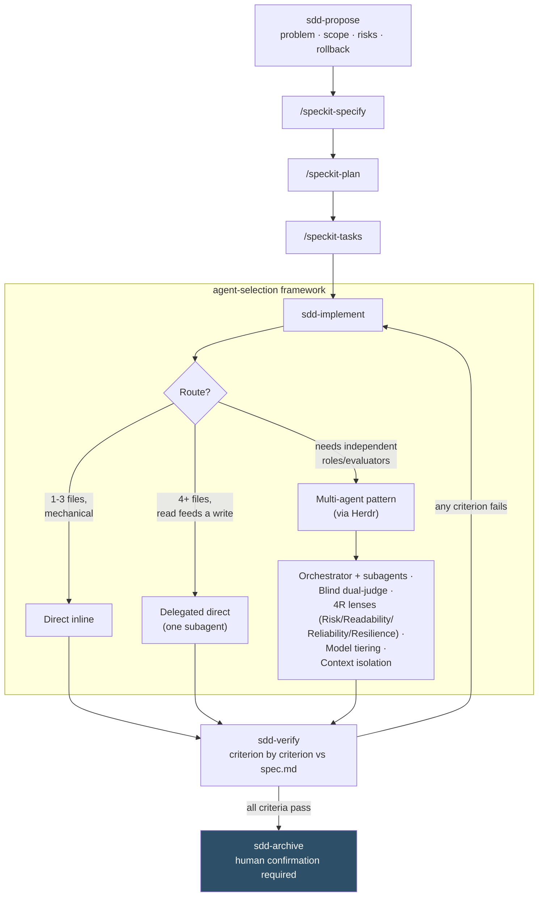

# herd

Claude Code skills repo. General repo principles in
[`.specify/memory/constitution.md`](.specify/memory/constitution.md) (Spec-Driven Development via
[Spec Kit](https://github.com/github/spec-kit)).

## Skills

- [`agent-selection`](.claude/skills/agent-selection/) — evaluates whether a task needs a single agent
  or a coordinated multi-agent pattern via Herdr, and which CLI/model to assign to each role.
- [`sdd-implement`](.claude/skills/sdd-implement/) — executes a Spec Kit feature's `tasks.md` by
  delegating each phase to `agent-selection`'s decision framework, instead of running everything
  inline like the native `/speckit-implement`.
- [`sdd-propose`](.claude/skills/sdd-propose/) — frames a feature (problem, scope, affected files,
  risks, rollback) before `/speckit-specify`, leaving `proposal.md` in the same folder as `spec.md`.
- [`sdd-verify`](.claude/skills/sdd-verify/) — verifies an already-implemented feature against
  `spec.md` with real evidence, criterion by criterion, in `verify-report.md`.
- [`sdd-archive`](.claude/skills/sdd-archive/) — archives a feature with a clean `verify-report.md` to
  `specs/_archive/`, with explicit human confirmation before moving anything.
- `speckit-*` — Spec Kit's 10 native skills (`constitution`, `specify`, `plan`, `tasks`,
  `implement`, `converge`, `clarify`, `analyze`, `checklist`, `taskstoissues`), installed by
  `specify init` unmodified.

This repo's full SDD cycle: `sdd-propose` → `speckit-specify` → `speckit-plan` →
`speckit-tasks` → `sdd-implement` (not `speckit-implement`) → `sdd-verify` → `sdd-archive`.

### The flow at a glance

## agent-selection

Skill that evaluates whether a task needs a single agent or a coordinated multi-agent pattern
via [Herdr](https://herdr.dev), and which CLI/model to assign to each role (Claude Code —including a
second instance as executor/judge—, Codex, opencode).

- Usage and criteria: [`SKILL.md`](.claude/skills/agent-selection/SKILL.md)
- Version history: [`CHANGELOG.md`](.claude/skills/agent-selection/CHANGELOG.md)
- Method and findings from the security round (no active pending items):
  [`TODO.md`](.claude/skills/agent-selection/TODO.md)
